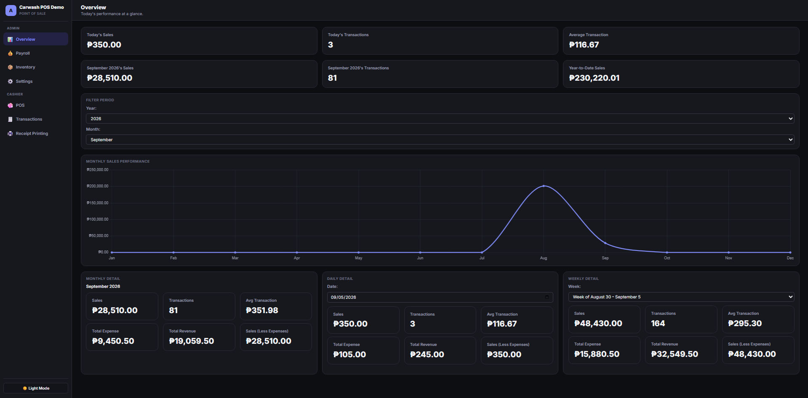

# Carwash POS System — Landing Page

A single-page marketing site for **Carwash POS System**, a point of sale built specifically for car wash businesses — checkout, inventory, payroll, and sales reporting in one place.

🔗 **Live preview:** open `index.html` locally, or deploy with GitHub Pages (see below).



## About this page

This repo contains the marketing/landing page only — a static, single-file website used to showcase and sell the Carwash POS System product. It is not the POS application itself.

The page covers:

- A hero section with the core pitch and pricing
- A feature grid summarizing the 8 core capabilities (checkout, customer & vehicle capture, services & pricing, inventory, payroll, receipts, payments, reports)
- A product tour with real screenshots from the system (Point of Sale, Overview dashboard, Transactions, Receipt Printing, Inventory, Settings)
- A 4-step "how it works" workflow
- A one-time pricing plan
- A contact / demo request call-to-action

## Tech stack

Plain HTML + CSS. No build step, no framework, no dependencies other than a Google Fonts import (`DM Sans`).

- `index.html` — the entire page (markup + `<style>` in one file)
- `assets/` — product screenshots used throughout the page

This keeps the page trivial to host anywhere: GitHub Pages, Netlify, Vercel, S3, or a plain web server.

## Project structure

```
.
├── index.html
├── README.md
└── assets/
    ├── pos.png            # Point of Sale — new transaction screen
    ├── dashboard.png      # Overview — sales dashboard & reports
    ├── transactions.png   # Transactions — searchable sales history
    ├── receipt.png        # Receipt Printing — lookup & print
    ├── inventory.png      # Inventory — stock & low-stock tracking
    └── settings.png       # Settings — services, packages & pricing
```

## Running locally

No build tools required. Either:

**Open directly**
```bash
open index.html        # macOS
start index.html       # Windows
xdg-open index.html    # Linux
```

**Or serve it** (recommended, avoids any local file/CORS quirks):
```bash
python3 -m http.server 8000
# then visit http://localhost:8000
```

## Deploying to GitHub Pages

1. Push this repo to GitHub.
2. Go to **Settings → Pages**.
3. Under **Build and deployment**, set **Source** to `Deploy from a branch`.
4. Choose the `main` branch and `/ (root)` folder, then save.
5. Your page will be live at `https://<your-username>.github.io/<repo-name>/`.

## Customizing

All content lives in `index.html`:

- **Copy & pricing** — edit the text directly inside each `<section>`. The pricing block is under `id="pricing"`.
- **Contact details** — update the `mailto:` links (currently `charlesenrickcajan@gmail.com`) and the Messenger link (`https://m.me/charlesgpt`) in the `#pricing` and `#demo` sections.
- **Colors & type** — all design tokens are declared once at the top of the `<style>` block under `:root` (e.g. `--accent`, `--bg`, `--text`).
- **Screenshots** — replace files inside `assets/` (keep the same filenames, or update the `src` attributes in `index.html` if you rename them).
- **Social preview image** — update the `og:image` meta tag if you change `assets/dashboard.png`, and set an absolute URL once the site has a real domain.

## Screenshots used

| File | Screen |
|---|---|
| `assets/pos.png` | Point of Sale — new transaction |
| `assets/dashboard.png` | Overview — sales dashboard |
| `assets/transactions.png` | Transactions — search & history |
| `assets/receipt.png` | Receipt Printing |
| `assets/inventory.png` | Inventory tracking |
| `assets/settings.png` | Settings — services & pricing |

All screenshots show sample data from a demo environment.

## License

Add a license of your choice (e.g. MIT) if you intend to open-source this repository. No license is included by default.
